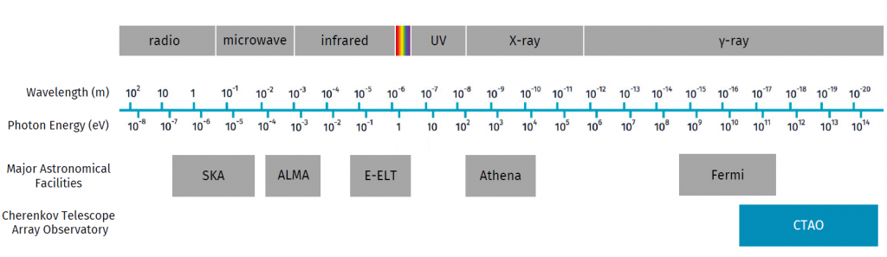

# CTAO Performance - version prod5

**Please check the CTA webpage ([https://www.cta-observatory.org/science/cta-performance/](https://www.cta-observatory.org/science/cta-performance/)) for the most recent instrument response functions.**
All results presented below are based on IRF version prod5 v0.1.

The CTA Observatory (CTAO) will provide very wide energy range and excellent angular resolution and sensitivity in comparison to any existing gamma-ray detector. Energies down to 20 GeV will allow CTAO to study the most distant objects. Energies up to 300 TeV will push CTAO beyond the edge of the known electromagnetic spectrum, providing a completely new view of the sky. Here is how CTAO’s energy range will compare to some of the existing astronomical instruments:

The plots on this page represent the preliminary performance expected from CTAO during its first construction phase with the “Alpha Configuration,” as obtained from detailed Monte Carlo (MC) simulations of the facility.

The performance is that of the approved “Alpha Configuration” for the southern and northern arrays of the CTA Observatory, located at the Paranal Observatory (Chile) and Roque de los Muchachos Observatory (Spain) respectively, and consisting of:

- CTAO Northern Array: 4 Large-Sized Telescopes and 9 Medium-Sized Telescopes (area covered by the array of telescopes: ~0.25 km2)
- CTAO Southern Array: 14 Medium-Sized Telescopes and 37 Small-Sized Telescopes (area covered by the array of telescopes: ~3 km2)

## Sensitivity

The differential sensitivity shown below is defined as the minimum flux needed by CTAO to obtain a 5-standard-deviation detection of a point-like source, calculated in non-overlapping logarithmic energy bins (five per decade). Besides the significant detection, we require at least ten detected gamma rays per energy bin, and a signal/background ratio of at least 1/20.  The analysis cuts in each bin have been optimised to achieve the best flux sensitivity to point-like sources. The optimal cut values depend on the duration of the observation, therefore the performance curves are provided for three different observation times: 0.5, 5 and 50 hours.

Note that the curves for Fermi-LAT and HAWC are scaled by a factor 1.2 relative to the references (see below), to account for the different energy binning. The curves shown allow only a rough comparison of the sensitivity of the different instruments, as the method of calculation and the criteria applied are not identical. In particular, the definition of the differential sensitivity for HAWC is rather different due to the lack of an accurate energy reconstruction for individual photons in the HAWC analysis.

Sources:

- ASTRI: https://pos.sissa.it/395/884/pdf
- Fermi-LAT: public specifications webpage http://www.slac.stanford.edu/exp/glast/groups/canda/lat_Performance.htm
- HAWC: arXiv:1701.01778
- H.E.S.S.: Preliminary sensitivity curves for H.E.S.S.-I (stereo reconstruction), based on/adapted from Holler et. al 2015 (Proceedings of the 34th ICRC)
- MAGIC: Astroparticle Physics 72 (2016) 76-94
- LHAASO: https://arxiv.org/abs/1905.02773
- SWGO (previously called SGSO): arXiv:1902.08429
- VERITAS: public specifications webpage https://veritas.sao.arizona.edu/about-veritas/veritas-specifications

## Sensitivity vs Observation Time

Differential flux sensitivity of CTAO-North at selected energies as function of observation time in comparison with the Fermi-LAT instrument (Pass 8 analysis, extragalactic background, standard survey observing mode). The differential flux sensitivity is defined as the minimum flux needed to obtain a 5-standard-deviation detection from a point-like gamma-ray source, calculated for energy bins of a width of 0.2 decades. An additional constraint of a minimum of 10 excess counts is applied. Note that especially for exposures longer than several hours, the restrictions on observability of a transient object are much stricter for CTAO than for the Fermi-LAT. CTAO will be able to observe objects above 20 degrees elevation during dark sky conditions. The differential flux sensitivity shown above are for observations near 70-degree elevation angles.

## Angular Resolution

The angular resolution vs. reconstructed energy curve shows the angle within which 68% of reconstructed gamma rays fall, relative to their true direction. Gamma-hadron separation cuts are applied for the MC events used to determine the angular resolution. Dedicated analysis cuts can provide improved angular (or spectral) resolution at the expense of collection area, enabling e.g. a better study of the morphology or spectral characteristics of bright sources.

## Energy Resolution and Energy Dispersion Matrix

The energy resolution ΔE / E is obtained from the distribution of (ER – ET) / ET, where R and T refer to the reconstructed and true energies of gamma-ray events recorded by CTAO. ΔE/E is the half-width of the interval around 0 which contains 68% of the distribution. The plot shows the energy resolution as a function of reconstructed energy  (the result depends only weakly on the assumed gamma-ray spectrum; for the results here we use dNɣ/dE ~E-2.62).

## Collection Area

The effective collection area for gamma rays from a point-like source is shown below vs. ET for gamma/hadron cuts optimised for 0.5-, 5- and 50-h observations (no cut in the reconstructed event direction applied):

The effective collection area with cuts in the reconstructed event direction:

## Background Rate

The (post-analysis) residual cosmic-ray background rate per square degree vs reconstructed gamma-ray energy ER is shown below.

The rate is the one integrated in 0.2-decade-wide bins in estimated energy (i.e. five bins per decade). Gamma-hadron separation cuts optimised for different observing times are applied to the selection of simulated cosmic-ray proton and electron events.

For details on the assumed cosmic-ray proton and electron spectra, see Bernlöhr et al 2013.

## Off-Axis Sensitivity

All performance parameters presented above are valid for a source located close to the centre of the CTA field of view (FoV). The differential sensitivity curves for a point-like source at increasing angular distances from the centre of the FoV are shown below.

Angular and energy resolution also degrade as one approaches the edge of the FoV. The provided IRFs contain the evolution of all performance parameters with off-axis angle.

## Notes

- All performance values are derived from detailed Monte Carlo (MC) simulations. The MC simulations are similar to the ones presented in Bernlöhr et al 2013, but using Corsika 7.71 (with URQMD + QGSJET-II-04), an updated detector model of the CTAO telescopes, and optimized array layouts (the so-called ‘Production 5’ or ‘Prod 5’).

- All performance values shown here refer to the first construction phase with an array configuration of 4 LSTs and 9 MSTs in the northern site (CTAO-North), and 14 MSTs and 37 SSTs in the southern site (CTAO-South), named “Alpha Configuration.”

- In the past, performance for the “Omega Configuration”, formerly referred to as the baseline configuration with 118 telescopes divided into both sites, was provided (the so-called ‘Prod 3b’, archived and available here). The “Omega Configuration” refers to the full-scope configuration that could be deployed in the Operation and Enhancement Phase depending on the available funds. The “Alpha Configuration” is the current official configuration and is not a subset of the “Omega Configuration” in terms of telescope positions.

